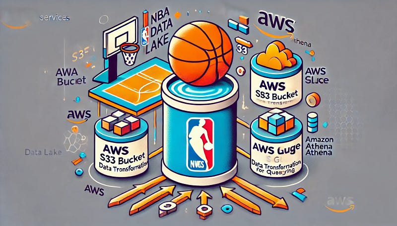

# NBA Data Lake with AWS

This repository contains the code and instructions for building an NBA Data Lake using AWS services, including S3, Glue, and Athena. This project demonstrates how to automate data collection, storage, and analysis using serverless technologies.

**Project Overview**

This project aims to:

1. **Fetch NBA player data:** Retrieve real-time NBA player data from the Sportsdata.io API.
2. **Store data in S3:** Store the fetched data in an S3 bucket for secure and scalable storage.
3. **Create a Glue table:** Use AWS Glue to create a table for the NBA player data, defining the schema and data types.
4. **Query data with Athena:** Use Athena to query the data and gain insights into player performance, team statistics, and more.
5. **Automate the process:** Leverage Python and AWS services to automate the entire data pipeline.

**Technologies Used**

* **AWS:** S3, Glue, Athena
* **Programming Language:** Python
* **External API:** Sportsdata.io NBA API

**Prerequisites**

* An AWS account with necessary permissions.
* AWS CLI or CloudShell.
* Python 3.x installed on your system.
* A text editor (e.g., VS Code, Sublime Text).
* Git installed on your system.
* A Sportsdata.io account and API key.

**Getting Started**

1. **Clone the repository:**
   
   git clone <https://github.com/danielhensha2/nba-data-lake.git>

**Navigate to the project directory:**

cd nba-data-lake

**Install required packages (if applicable):**
pip install -r requirements.txt 

**Create a .env file:**
* Create a file named .env in the project directory.
* Add the following lines to the .env file:

SPORTS_DATA_API_KEY=<your_api_key>
NBA_ENDPOINT=[https://api.sportsdata.io/v3/nba/scores/json/Players](https://api.sportsdata.io/v3/nba/scores/json/Players)

* Replace <your_api_key> with your actual Sportsdata.io API key.
**Run the setup script:**

python setup_nba_data_lake.py
**Verify S3 bucket creation:**

* Navigate to the S3 console in the AWS Management Console.
* Locate the created S3 bucket.
**Run a query in Athena:**

* Navigate to the Athena console.

* Run the following query:
SELECT FirstName, LastName, Position, Team 
FROM nba_players 
WHERE Position = 'PG';

**Contributing**

* Contributions to this project are welcome. Please feel free to fork the repository and submit pull requests.   

**License**

* This project is licensed under the MIT License.   

**Contact**

* Daniel Osarobo: 

* LinkedIn: www.linkedin.com/in/daniel-osarobo

* Read the Full Write Up on Medium: https://medium.com/@danielosarobo/from-courtside-to-cloud-side-building-an-nba-data-lake-with-aws-s3-glue-and-athena-da88b26f2a25

